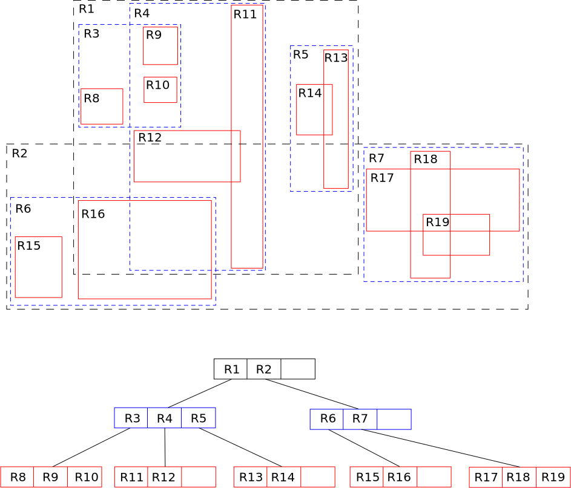
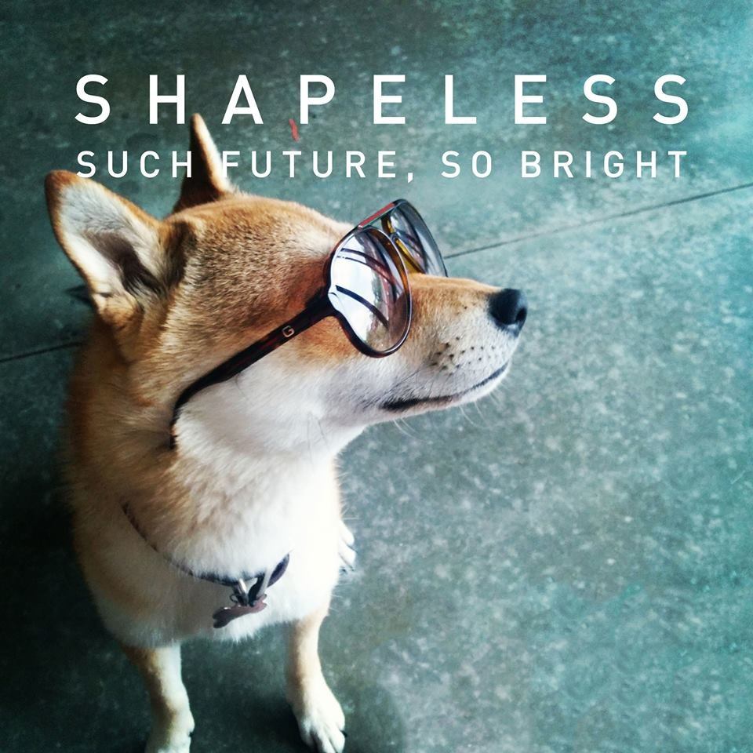

# Generic N-Dim <br> R-Tree Explorations

_or how I learned to calm the hyperspatial index_

[Dave Rostron](http://github.com/drostron) — [\@yastero](http://twitter.com/yastero)

Feb 17, 2015

---

> All our wisdom is stored in the trees.
>
> — Santosh Kalwar

---

## opening notes and such

- presentation plan? perhaps depends on how long this gets
- warning: this is not complete
- just a place for exploration
- more of a chance to dig into shapeless than look in depth at R-Trees
- help me if you know someting that I left out or could improve on, no claims of expertise, just having some fun, join me

---

## exploration inspiration

<div class="fragment">

"Designing Data-Intensive Applications"
by Martin Kleppmann (_recommended_)


</div>

---

## how do we find the needle in the haystack?

- could scan through the whole stack
- maybe there's something faster
- B-Tree to the rescue 

---

## wait, we want to index our data over multiple dimensions

- could get part of the way there with a B-Tree but what about a range query over both dimensions?
- R-Tree to the rescue 

---

R-Tree Overview

- spatial n-dimensional index

- variants: M-Tree, X-Tree, Hilbert R-tree
- sounds useful, tell us more...

---

how bout some code

. . .

```tut
trait Data2D {
  case class Point[T](x: T, y: T)
  case class Entry[V, T](value: V, point: Point[T])
  case class Box[T](xLower: T, xUpper: T, yLower: T, yUpper: T) // inclusive

  sealed trait RTree[V, T]
  case class Empty[V, T]() extends RTree[V, T]
  case class Leaf[V, T](entry: Entry[V, T]) extends RTree[V, T]
  case class Node[V, T](
    box: Box[T], left: RTree[V, T], right: RTree[V, T])
    extends RTree[V, T]
}
object data2D extends Data2D
```

---

```tut
import data2D._, spire._, algebra._, math.{ min, max }, implicits._

trait Ops2D {
  def initBox[T : Order](point1: Point[T], point2: Point[T]): Box[T]

  def expandBox[T : Order](box: Box[T], point: Point[T]): Box[T]

  def expandBox[T : Order](box1: Box[T], box2: Box[T]): Box[T]

  def withinBox[T : Order](box: Box[T], point: Point[T]): Boolean

  def overlaps[T : Order](box1: Box[T], box2: Box[T]): Boolean

  def add[V, T](rtree: RTree[V, T], entry: Entry[V, T]): RTree[V, T]

  def remove[V, T](rtree: RTree[V, T], entry: Entry[V, T]): RTree[V, T]

  def find[V, T](rtree: RTree[V, T], point: Point[T]): Option[Entry[V, T]]

  def contains[V, T](rtree: RTree[V, T], entry: Entry[V, T]): Boolean

  def search[V, T](space: Box[T]): List[Entry[V, T]]
}
```

---

types might be sufficient for this part of the story and save impl for HList version?

```tut
object ops2D extends Ops2D {
  def initBox[T : Order](point1: Point[T], point2: Point[T]): Box[T] = Box(
    min(point1.x, point2.x), max(point1.x, point2.x),
    min(point1.y, point2.y), max(point1.y, point2.y))

  def expandBox[T : Order](box: Box[T], point: Point[T]): Box[T] = Box(
    min(box.xLower, point.x), max(box.xUpper, point.x),
    min(box.yLower, point.y), max(box.yUpper, point.y))

  def expandBox[T : Order](box1: Box[T], box2: Box[T]): Box[T] = Box(
    min(box1.xLower, box2.xLower), max(box1.xUpper, box2.xUpper),
    min(box1.yLower, box2.yLower), max(box1.yUpper, box2.yUpper))

  def withinBox[T : Order](box: Box[T], point: Point[T]): Boolean =
    box.xLower <= point.x && point.x <= box.xUpper &&
    box.yLower <= point.y && point.y <= box.yUpper

  def overlaps[T : Order](box1: Box[T], box2: Box[T]): Boolean =
    box1.xLower <= box2.xUpper && box1.xUpper >= box2.xLower &&
    box1.yLower <= box2.yUpper && box1.yUpper >= box2.yLower

  def add[V, T](rtree: RTree[V, T], entry: Entry[V, T]): RTree[V, T] = ???

  def remove[V, T](rtree: RTree[V, T], entry: Entry[V, T]): RTree[V, T] = ???

  def find[V, T](rtree: RTree[V, T], point: Point[T]): Option[Entry[V, T]] = ???

  def contains[V, T](rtree: RTree[V, T], entry: Entry[V, T]): Boolean = ???

  def search[V, T](space: Box[T]): List[Entry[V, T]] = ???
}
```

---

what if we have more than 2 dimensions?

. . .

```tut

trait DataDynamicNDim {
  case class Point[T](terms: List[T])
  case class Entry[V, T](value: V, point: Point[T])
  case class Box[T](lowerBounds: List[T], upperBounds: List[T])

  sealed trait RTree[V, T]
  case class Empty[V, T]() extends RTree[V, T]
  case class Leaf[V, T](entry: Entry[V, T]) extends RTree[V, T]
  case class Node[V, T](
    box: Box[T], left: RTree[V, T], right: RTree[V, T])
    extends RTree[V, T]
}
```

---

> Traveling through hyperspace ain't like dusting crops, farm boy. Without precise calculations we could fly right through a star or bounce too close to a supernova, and that'd end your trip real quick, wouldn't it?
>
> — Han Solo, Star Wars Episode IV: A New Hope

. . .


---

I hear type systems perform calculations

. . .

and support a class of constraints

. . .

there's a library that explores this space

. . .

shapeless : supercharged generic coding

---

> Empty your mind, be formless. Shapeless, like water.
>
> — Bruce Lee

. . .


. . .

let's build a well typed Generic N-Dim R-Tree

---

shapeless Sized

. . .

```tut
import shapeless._, ops.nat._

trait DataSizedNDim {
  case class Point[T, N <: Nat](terms: Sized[Seq[T], N])
  case class Entry[V, T, N <: Nat](value: V, point: Point[T, N])
  case class Interval[T](l: T, u: T)
  case class Box[T, N <: Nat](intervals: Sized[Seq[Interval[T]], N])

  sealed trait RTree[T, N <: Nat]
  case class Leaf[T, N <: Nat](point: Point[T, N]) extends RTree[T, N]
  case class Node[T, N <: Nat](
    bound: Box[T, N], left: RTree[T, N], right: RTree[T, N])
    extends RTree[T, N]
}
```

. . .

perhaps, what if we want heterogeneous types for our dimensions?

---

shapeless HList

. . .

```tut
trait DataHListNDim {
  case class Point[T <: HList](terms: T)
  case class Entry[V, T <: HList](value: V, point: Point[T])
  case class Box[T <: HList](lowerBounds: T, upperBounds: T) // inclusive

  sealed trait RTree[V, T <: HList]
  case class Empty[V, T <: HList]() extends RTree[V, T]
  case class Leaf[V, T <: HList](entry: Entry[V, T]) extends RTree[V, T]
  case class Node[V, T <: HList](
    box: Box[T], left: RTree[V, T], right: RTree[V, T])
    extends RTree[V, T]
}
object dataHListNDim extends DataHListNDim
```

. . .

looks promising

---

note: intentionally postponed a few items

- balancing
- splitting
- performance
- heterogeneous distance function (_similarity_)

---

```tut
import dataHListNDim._, shapeless.ops.hlist._

trait OpsHListFunctions {
  object minimum extends Poly2 {
    implicit def default[T : Order] = at[T, T](implicitly[Order[T]].min)
  }

  object maximum extends Poly2 {
    implicit def default[T : Order] = at[T, T](implicitly[Order[T]].max)
  }

  object lte extends Poly2 {
    implicit def default[T : Order] = at[T, T](_ <= _)
  }

  object gte extends Poly2 {
    implicit def default[T : Order] = at[T, T](_ >= _)
  }

  object and extends Poly2 {
    implicit def caseBoolean = at[Boolean, Boolean](_ && _)
  }
}
```

---

```tut
trait OpsHListTypes { self: OpsHListFunctions =>
  type ZWMin[T <: HList] = ZipWith.Aux[T, T, minimum.type, T]
  type ZWMax[T <: HList] = ZipWith.Aux[T, T, maximum.type, T]

  type ZWLB[T <: HList] = {
    type λ[U <: HList] = ZipWith.Aux[T, T, lte.type, U]
  }
  type ZWUB[T <: HList] = {
    type λ[U <: HList] = ZipWith.Aux[T, T, gte.type, U]
  }

  type LFLB[T <: HList] = {
    type λ[U <: HList] =
      LeftFolder.Aux[
        ZipWith.Aux[T, T, lte.type, U]#Out,
        Boolean,
        and.type,
        Boolean]
  }
  type LFUB[T <: HList] = {
    type λ[U <: HList] =
      LeftFolder.Aux[
        ZipWith.Aux[T, T, gte.type, U]#Out,
        Boolean,
        and.type,
        Boolean]
  }
}
```

---

```tut
trait OpsHList extends OpsHListFunctions with OpsHListTypes {
  def initBox
    [T <: HList : ZWMin : ZWMax]
    (point1: Point[T], point2: Point[T])
    : Box[T] = Box(
    point1.terms.zipWith(point2.terms)(minimum),
    point1.terms.zipWith(point2.terms)(maximum))

  def expandBox
    [T <: HList : ZWMin : ZWMax]
    (box: Box[T], point: Point[T])
    : Box[T] = Box(
    box.lowerBounds.zipWith(point.terms)(minimum),
    box.upperBounds.zipWith(point.terms)(maximum))

  def withinBox
    [T <: HList, L <: HList : ZWLB[T]#λ : LFLB[T]#λ, U <: HList : ZWUB[T]#λ : LFUB[T]#λ]
    (box: Box[T], point: Point[T])
    : Boolean =
    box.lowerBounds.zipWith(point.terms)(lte).foldLeft(true)(and) &&
    box.upperBounds.zipWith(point.terms)(gte).foldLeft(true)(and)

  def overlaps
    [T <: HList, L <: HList : ZWLB[T]#λ : LFLB[T]#λ, U <: HList : ZWUB[T]#λ : LFUB[T]#λ]
    (box1: Box[T], box2: Box[T])
    : Boolean =
    box1.lowerBounds.zipWith(box2.upperBounds)(lte).foldLeft(true)(and) &&
    box1.upperBounds.zipWith(box2.lowerBounds)(gte).foldLeft(true)(and)
}
```

. . .

incomplete implementation for for sake of brevity

---

still with me? good, let's speed this up a bit.

. . .

```tut
import ndimrtree._, NDimRTree._

val b1 = initBox(Point(1 :: HNil), Point(3 :: HNil))

val b2 = initBox(Point(2 :: HNil), Point(4 :: HNil))

import shapeless.test._

illTyped("""

initBox(Point(1 :: HNil), Point("a" :: HNil))

""")

expandBox(b1, b2)

illTyped("""

expandBox(b1, b3)

""")

val t1: RTree[String, Int :: Double :: HNil] = RTree(List(Entry("z", Point(3 :: 1.7 :: HNil))))

illTyped("""

val t1: RTree[String, Int :: Long :: HNil] = RTree(List(Entry("z", Point(3 :: 1.7 :: HNil))))

""")


```

---

_a few more examples here_

---

_show a scalacheck example_

_show results_

---

fun things explored

- rtrees (but you already know that)
- indexes
- typelevel generic programming
    - hlists, map, zip, etc operations over hlists

---

 libraries utilized

_add brief description of how each was utilized_

> - [shapeless](https://github.com/milessabin/shapeless) : Generic programming for Scala
> - [spire](https://github.com/non/spire) : Powerful new number types and numeric abstractions for Scala
> - [scalacheck](https://github.com/rickynils/scalacheck) : Property-based testing for Scala
> - [scalacheck-shapeless](https://github.com/alexarchambault/scalacheck-shapeless) : Generation of arbitrary case classes / ADTs with scalacheck and shapeless
> - [archery](https://github.com/meetup/archery) : 2D R-Tree implementation in Scala
>    - leveraged for scalacheck tests and benchmarking
> - [thyme](https://github.com/Ichoran/thyme) -  microbenchmark utility for Scala
> - [scalaz](https://github.com/scalaz/scalaz) - An extension to the core Scala library for functional programming
>     - utilized mostly for type-safe equality (_looking forward to cats_)
> - [tut](https://github.com/tpolecat/tut) - doc/tutorial generator for scala
>     - sending the code you've been looking at to scalac

---

initial performance comparisons tests:

plenty of room for improvement. just a first naive pass at the moment. if interested let's hack together.

---

caveats:

don't use this in production or if you think it is useful let's crisp up the implementation together

---

future explorations

- R-Tree variants, e.g. M-Tree, X-Tree, Hilbert R-tree
- heterogenous distance functions
- distributed spark impl
- run k-means against all the coordinates on in the R-Tree, show the result on the map, utilize the R-Tree to look up associated data with that coordinate
- specialization and/or miniboxing
- turn it into a usable and efficient library
- visualization with d3, perhaps leverage archery and scala-js

---

Thanks!

repo : [rtree-explorations](https://github.com/drostron/rtree-explorations)


